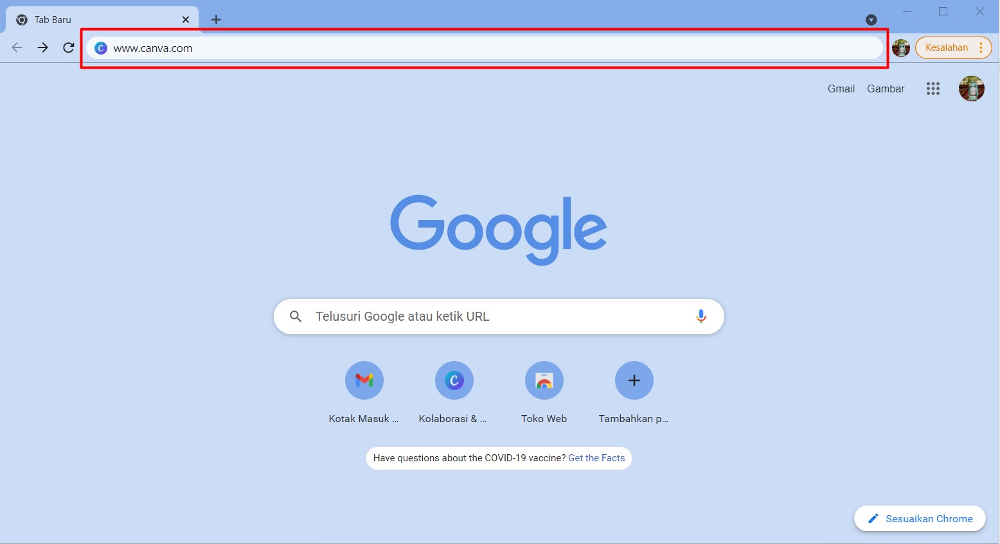
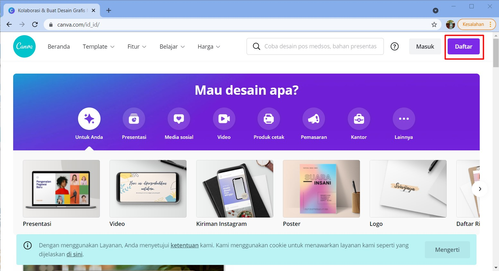
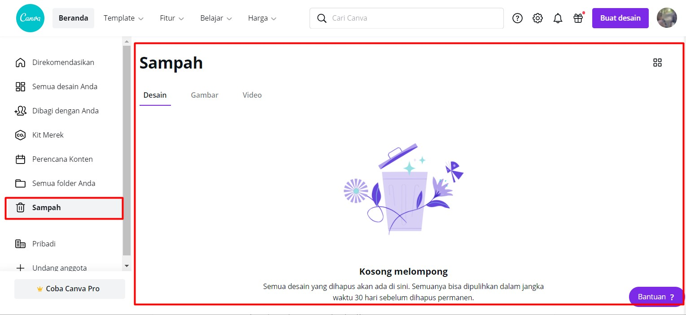
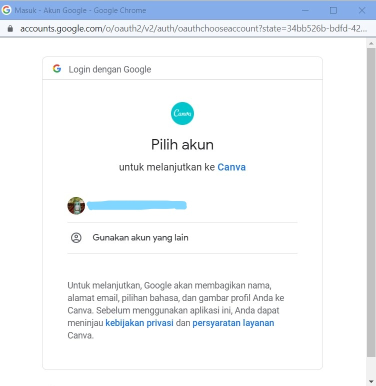
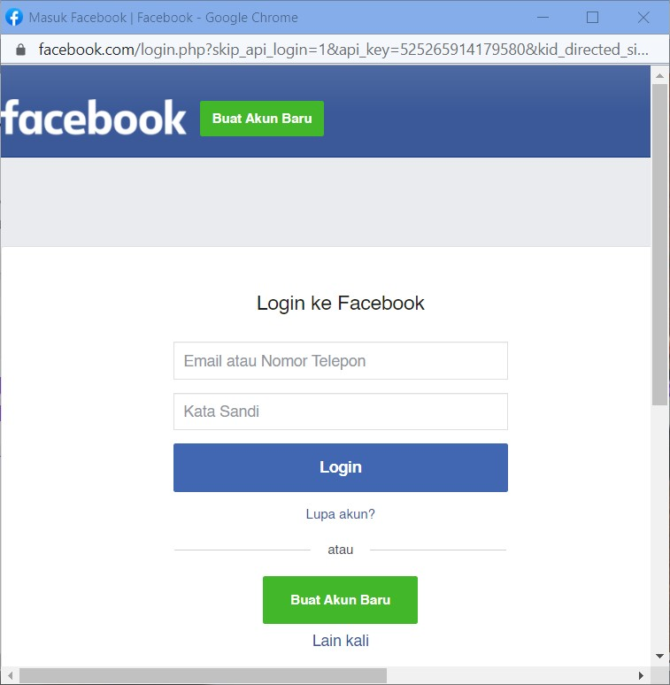
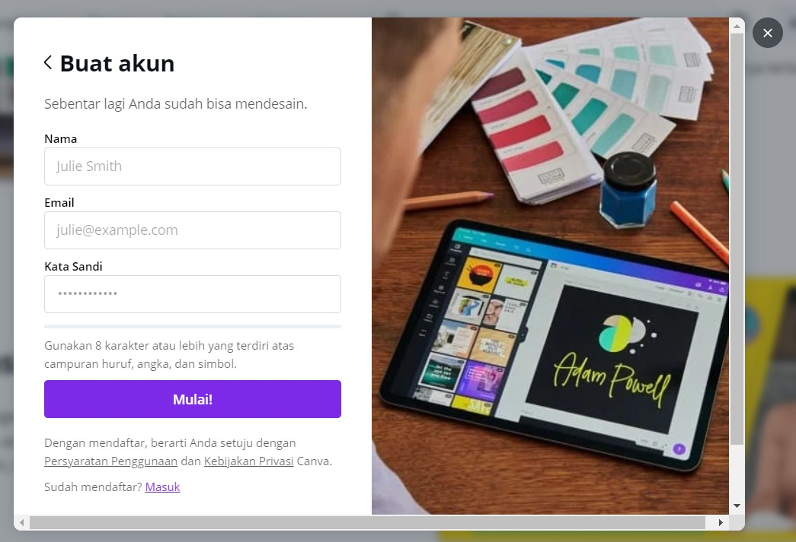

# 2. Persiapan

Yang perlu anda persiapkan dalam menggunakan canva yaitu :

1. Perangkat berupa HP, Laptop, PC, dsb.
2. Internet yang memadai
3. Browser yang mensupport
4. Browser yang dapat anda gunakan yaitu chrome, mozilla, microsoft edge, dsb.
5. Akun email untuk membuat akun canva.

Tentu untuk mengakses atau menggunakan canva terlebih dahulu dianjurkan untuk membuat akun dengan menggunakan email. Dengan adanya akun tersebut akan **memudahkan anda untuk menyimpan desain yang telah dibuat**. Pada modul ini kami memberikan contoh langkah dengan menggunakan perangkat laptop atau PC.

**Adapun langkah-langkahnya sebagai berikut :**

#### 1. Membuka halaman canva dengan alamat www.canva.com pada penelusuran google, sebagai berikut :

 

 

Gambar 2.1 Membuka website Canva
  

#### 2. Maka selanjutnya tampilan yang akan diberikan adalah halaman utama canva. Selanjutnya arahkan kursor anda ke tombol Daftar dan klik tombol tersebut.!

 

 

Gambar 2.2 Halaman utama Canva

#### 3. Tampilan yang akan diberikan selanjutnya merupakan pop up pendaftaran dengan akun google, akun facebook, atau email yang anda punya. Anda cukup memilih satu di antaranya.  

 

 

Gambar 2.3 Membuat akun Canva
  

Apabila anda memilih :  

a. **Daftar dengan Google**, maka anda akan diarahkan untuk memilih akun google yang ingin anda daftarkan.  

 

 

Gambar 2.3.1 Mendaftar dengan akun Google
  

b. **Daftar dengan Facebook**, maka anda akan diarahkan ke halaman Log In facebook.  

 

 

Gambar 2.3.2 Mendaftar dengan akun Facebook
  

c. **Daftar dengan email**, maka anda akan diarahkan ke halaman pendaftaran dengan email.  

 

 

Gambar 2.3.3 Mendaftar dengan Email
  

