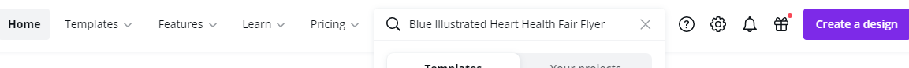
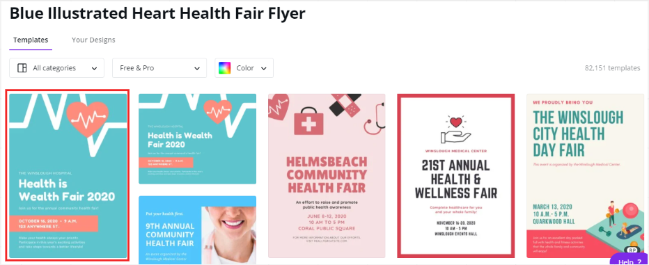
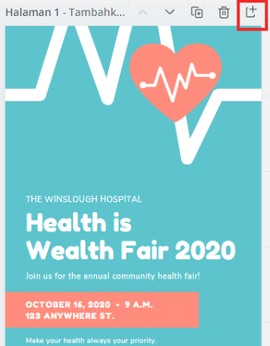
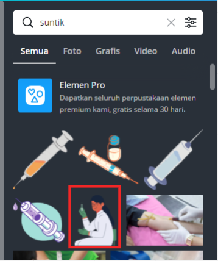
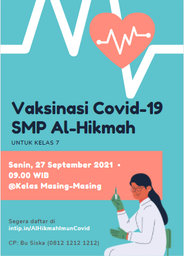
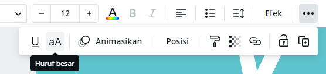
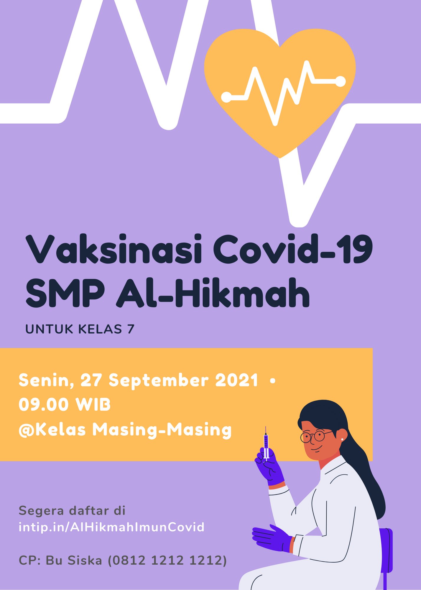
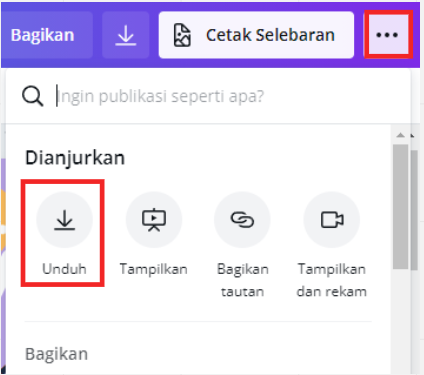

# 5. Praktek

## A. Membuat Instagram Carousel
Berikut merupakan contoh yang akan dibuat :  

Gambar 5.1 Instagram Carousel
  

Sebelumnya apa itu carousel? carousel adalah salah satu jenis konten atau bentuk tampilan visual yang tersedia di dalam media sosial. Karakteristik utama dari carousel adalah terdiri atas lebih dari satu gambar dalam satu konten.  

Carousel sendiri bersifat interaktif, dimana pengguna atau user dapat menggeser deretan gambar secara berurutan dan pada umumnya dimanfaatkan untuk proses pembuatan konten post pada media sosial. 
Berbeda dengan post gambar yang tidak menerapkan konsep carousel akan bersifat statis dan tidak terjadi sebuah interaksi disana.  

Nah selanjutnya bagaimana cara membuat carousel seperti contoh di atas?   
**Langkah pertama :** Membuat canvas dengan ukuran khusus yakni ``4000 x 1000 piksel``  

Gambar 5.2 Membuat canvas dengan ukuran khusus
  

Maka anda akan diarahkan ke halaman desain sebagai berikut :  

Gambar 5.3 Halaman desain canva
  

**Langkah kedua :** Menampilkan penggaris dan petunjuk  

Gambar 5.4 Menampilkan penggaris dan petunjuk
  
  
Untuk menampilkannya anda cukup menekan tombol **File > Tampilkan penggaris** dan **File > Tampilkan petunjuk**. Tekan kedua opsi tersebut hingga terdapat simbol centang pada sebelah kanan opsi.  

**Langkah ketiga :** Membuat garis petunjuk dengan jarak antar petunjuk sebesar **1000** hingga terbentuk 4 batas atau petunjuk di dalam canvas dengan cara menarik garis dari penggaris yang telah tertampilkan.  

Gambar 5.5 Membuat garis bantu atau petunjuk 
  
 
**Langkah keempat :** Masukkan elemen pelangi pada canvas. Elemen tersebut didapat dengan melakukan pencarian diopsi elemen dengan ``kata kunci:brand BABj9f0X1bg line``.  

Gambar 5.6 Memasukkan elemen pelangi
    

Masukkan satu persatu elemen yang sesuai ke dalam canvas dan atur elemen tersebut hingga membentuk rangkaian sebagai berikut :  

Gambar 5.7 Rangkaian pelangi pada canvas
  
  
**Langkah kelima :** Atur warna background canvas dengan ``kode warna: #5e17eb``. Anda cukup memasukkan kode warna tersebut ke dalam pencarian lalu pilih warna yang telah ditampilkan sesuai dengan hasil pencarian.  

Gambar 5.8 Mengatur warna background
    
  
Pada tahap ini anda telah menyelesaikan bagian background dari carousel yang akan anda buat. Selanjutnya anda akan memasuki tahapan dalam membuat isi dari carousel.    

**Langkah keenam :** Membuat halaman pertama (sampul)  

Gambar 5.9 Halaman pertama (sampul) 
  
 
Berdasarkan gambar tersebut yang perlu anda siapkan adalah elemen sebagai berikut :  
1. Elemen pensil  

Gambar 5.10 Elemen Pensil
  
  

Elemen tersebut dapat anda dapatkan dengan menginputkan ``kata kunci: pencil``.  

2. Elemen bintang  

Gambar 5.11 Elemen bintang 
  
 

Elemen tersebut dapat anda dapatkan dengan menginputkan ``kata kunci: star``.  

3. Elemen garis putus-putus  

Gambar 5.12 Elemen garis putus-putus
  

Elemen tersebut dapat anda dapatkan dengan menginputkan kata kunci string. Untuk menjadikannya berwarna kuning anda dapat menekan elemen tersebut dan pilih warna yang sesuai dengan memasukkan ``kode warna: #fcc70e``.   

Gambar 5.13 Mengubah warna elemen garis
    
  

4. Elemen garis titik-titik

Gambar 5.14 Elemen garis titik-titik
  

Elemen tersebut dapat anda dapatkan dengan menginputkan kata kunci dot. Untuk menjadikannya berwarna kuning anda dapat menekan elemen tersebut dan pilih warna yang sesuai dengan memasukkan ``kode warna: #fbb040``.  

Gambar 5.15 Mengubah warna elemen titik-titik
  

Setelah elemen-elemen tersebut dimasukkan ke canvas bagian halaman pertama, sesuaikan letak elemen dengan gambar contoh. Kemudian lanjutkan dengan menuliskan teks. Terdapat 3 teks pada halaman tersebut :

Gambar 5.16 Teks pada halaman pertama (sampul)
  

Langkah membuat **teks 1**:
a. **Klik opsi teks > Tambahkan judul**  dan Tuliskan kata **“How ?”**. Kemudian pilih font dengan nama **“Open Sans Extra”** dan ukuran font **82**

Gambar 5.17 Langkah a teks 1
  

b. **Klik efek** 
Pilih efek dengan nama **“splice” **.

Gambar 5.18 Langkah b teks 1 pilih efek
  

Sesuaikan warna dalam teks 1 dengan memasukkan ``kode warna: #bddfef``.  

Gambar 5.19 Langkah b teks 1 sesuaikan warna dalam teks
 

Sesuaikan warna luar teks 1 dengan memasukkan ``kode warna: #fcc70e``.  

Gambar 5.20 Langkah b teks 1 sesuaikan warna luar teks

 

 
Langkah membuat **teks 2** :  
a.) **Klik opsi teks > Tambahkan subjudul**  dan Tuliskan kata **“To Make”**. Kemudian pilih font dengan nama **“Oswald”** dan ukuran font **42**, kemudian pilih warna teks dengan ``kode warna: #fcc70e``.  

Gambar 5.21 Langkah a membuat teks 2 
 

Langkah membuat **teks 3** :   
a.) **Klik opsi teks > Tambahkan judul**  dan Tuliskan kata **“Carousel”**
Pilih font dengan nama **“Open Sans Extra”** dan ukuran font **125**, kemudian pilih warna teks dengan ``kode warna: #fcc70e``.

Gambar 5.22 Langkah a membuat teks 3
 

b.) **Klik efek**  
Pilih efek dengan nama **“Bayangan”** dan atur opsi transparansi hingga **100**. Kemudian pilih warna bayangan dengan ``kode warna: #f47f421``.  

Gambar 5.23 Langkah b membuat teks 3
 
  

**Langkah ketujuh :** Membuat halaman kedua (konten 1)  

Gambar 5.24 Halaman kedua (konten 1)
 
  

Berdasarkan gambar tersebut yang perlu anda siapkan adalah elemen sebagai berikut :   
1. Elemen nomor  

Gambar 5.24 Elemen nomor
 

Elemen tersebut dapat anda dapatkan dengan menginputkan ``kata kunci: set:nAEYaWWpG74`` pada pencariaan elemen. Untuk menjadikan warna elemen sesuai dengan gambar diatas, anda dapat melakukan pengaturan warna sebagai berikut, yang mana jika diurutkan dari kiri ``kode warna: #5e17eb, #ffff, #ffff, #fbb040``.   

Gambar 5.25 Mengatur warna elemen nomor 
  

 
2. Elemen karakter perempuan  

Gambar 5.25 Elemen orang
 
Elemen tersebut dapat anda dapatkan dengan menginputkan ``kata kunci set:nAEg2mZdnYs``.  

3. Elemen garis  

Gambar 5.26 Elemen garis ke 1 
  
 

Gambar 5.27 Elemen garis ke 2
 

Elemen tersebut dapat anda dapatkan dengan menginputkan kata kunci line. Untuk menjadikannya berwarna kuning anda dapat menekan elemen tersebut dan pilih warna yang sesuai dengan memasukkan ``kode warna: #fcc70e``.   
Setelah seluruh elemen sudah anda dapatkan buatlah teks dan tambahkan efek teks sesuai yang telah diajarkan pada desain halaman pertama (sampul), kemudian sesuaikan letak teks beserta elemen sesuai contoh gambar halaman kedua (konten 1).  

**Langkah kedelapan :** Membuat halaman ketiga (konten 2)  

Gambar 5.28 Halaman ketiga (konten 2)
  

Pada halaman ini elemen yang digunakan yaitu:  
1. Elemen Nomor  

Gambar 5.29 Elemen Nomor 
   

 
Elemen tersebut dapat anda dapatkan dengan menginputkan ``kata kunci set:nAEYaWWpG74`` pada pencarian elemen. Untuk menjadikan warna elemen sesuai dengan gambar diatas, anda dapat melakukan pengaturan warna sebagai berikut, yang mana jika diurutkan dari kiri ``kode warnanya: #5e17eb,#fbb040,#fbb040, #ffff``.  

2. Elemen bintang

Gambar 5.30 Elemen bintang
 

Elemen tersebut dapat anda dapatkan dengan menginputkan ``kata kunci: star``.  

3. Elemen pesawat

Gambar 5.31 Elemen pesawat
   

Elemen tersebut dapat anda dapatkan dengan menginputkan ``kata kunci set:nAEdaBtcoOg`` pada pencarian elemen. Untuk menjadikan warna elemen sesuai dengan gambar diatas, anda dapat menekan tombol edit dan sesuaikan dengan minat anda.  
Setelah seluruh elemen sudah anda dapatkan buatlah teks dan tambahkan efek teks sesuai efek teks yang telah diajarkan pada desain halaman pertama (sampul), kemudian sesuaikan letak teks beserta elemen sesuai contoh gambar halaman kedua (konten 2).    

**Langkah kesembilan :** Membuat halaman keempat (konten 3)  

Gambar 5.32 Halaman keempat (konten 3)
  

Pada halaman ini elemen yang digunakan yaitu :  
1. Elemen Nomor  

Gambar 5.33 Elemen Nomor
  

Elemen tersebut dapat anda dapatkan dengan menginputkan kata ``kunci set:nAEYaWWpG74`` pada pencarian elemen. Untuk menjadikan warna elemen sesuai dengan gambar diatas, anda dapat melakukan pengaturan warna sebagai berikut, yang mana jika diurutkan dari kiri ``kode warna: #f47241, #00c2cb,#fbb040, #5e17eb``.  

2. Elemen bintang

Gambar 5.34 Elemen bintang
 

Elemen tersebut dapat anda dapatkan dengan menginputkan ``kata kunci: star``.    

3. Elemen kardus  

Gambar 5.35 Elemen kardus
 

Elemen tersebut dapat anda dapatkan dengan menginputkan ``kata kunci: set:nAEdaBtcoOg`` pada pencarian elemen. 
Setelah seluruh elemen sudah anda dapatkan buatlah teks dan tambahkan efek teks sesuai efek yang telah diajarkan pada desain halaman pertama (sampul), kemudian sesuaikan letak teks beserta elemen sesuai contoh gambar halaman kedua (konten 3).  

**Langkah Kesepuluh :** Download hasil desain

Gambar 5.36 Unduh hasil desain
 

 
**Langkah Kesebelas :** Buka situs web https://pinetools.com/split-image
 

Gambar 5.37 Halaman website pine tools
 

Pada website ini anda dapat melakukan split atau memotong gambar sesuai garis petunjuk yang telah anda buat pada saat mendesain. Dimana setelah dilakukan splitting, yang semula hasil desain tersebut berupa persegi panjang akan terpecah menjadi 4 persegi dengan cara sebagai berikut.
Upload hasil desain yang telah di unduh.  

Gambar 5.38 Upload hasil desain
 

Ikuti pengaturan di bawah ini untuk melakukan split 

Gambar 5.40 Pengaturan split
   

Setelah dilakukan pengaturan tekan tombol **SPLIT IMAGE!**, setelah itu untuk mengunduh gambar yang telah di split, tekan tombol Download .zip file seperti dibawah ini.  

Gambar 5.41 Download .zip file
 

Setelah itu anda dapat mengekstrak file yang telah di unduh dan mempublikasikannya ke akun sosial media anda yakni instagram. Hasil ekstrak file sebagai berikut :

Gambar 5.42 Hasil unduhan split
 

## B. Membuat Poster
1. Pada search bar, tulis `Blue Illustrated Heart Health Fair Flyer`.

 

 

Gambar 5.43 Pencarian template poster

1. Pilih template berikut.

 

 

Gambar 5.44 Pilih template yang dimaksud

3. Anda dapat memulai desain sesuka Anda. Anda dapat menambah halaman untuk menaruh elemen yang tidak cukup ditaruh pada canvas yang Anda desain.

 

 

Gambar 5.45 Cara menambah halaman pada canvas

4. Cari elemen “suntik”. Ambil elemen berikut dan letakkan pada canvas.
   

 

 

Gambar 5.46 Elemen suntik

5. Ubah sedemikan rupa agar desain seperti ini. Anda dapat memakai menselect object dan pilih **Pisahkan** agar dapat select object secara terpisah. Anda juga dapat memilih menu **Huruf besar** agar teks menjadi kapital semua atau tidak.

 

 

Gambar 5.47 Desain poster

 

 

Gambar 5.48 Untuk mengubah jenis huruf

6. Ubah sedemikian rupa warna elemen-elemen pada poster agar menjadi seperti poster di bawah. Berikut petunjuk-petunjuk yang disediakan.
   
Warna yang digunakan:

Warna ungu background: #b9a2e6 , warna kuning: #ffbd59 , warna ungu sarung tangan: #5e17bd, warna hitam, warna putih, dan warna abu tua pada “segera daftar..”: #545454 .

 

 

Gambar 5.49 Perubahan warna elemen

7. Selesai. Unduh dengan mengklik titik tiga, kemudian **Unduh**. Pilih format png.

 

 

Gambar 5.50 Mengunduh poster

## C. Membuat Power Point
1. Pilih menu Buat Desain, kemudian pilih Presentasi.

2. Tambahkan slide untuk membuat slide baru.

3. Atur slide pertama sedemikian rupa.

Untuk masing-masing elemen, ada pada keterangan berikut.

Background: #E8FCCF

**Nomor 1**

Nama elemen: Modern Gradient S Shape Blob

Warna: gradient #FFBD59 dan #FFDE59

**Nomor 2**

Nama elemen: Modern Gradient S Shape Blob

Warna: gradient #3E8914 dan #95DF71

**Nomor 3**

Nama font: Arsenal, size 32, bold

Warna: abu, bebas

**Nomor 4**

Nama font: Noto Serif Display Black, size 120

Warna: coklat tua, bebas

**Nomor 5**

Nama elemen: Modern Gradient S Shape Blob

Warna: seperti pada nomor 2        

**Nomor 6**

Nama elemen: Modern Gradient S Shape Blob        

Warna: seperti nomor 1        

**Nomor 7**

Nama font: Arsenal, size 32, bold

Warna: seperti nomor 3

4. Tambah slide 2. Atur sedemikian rupa.

Untuk masing-masing elemen, ada pada keterangan berikut.

Background: #E8FCCF

**Nomor 1**

Elemen bingkai yang berbentuk seperti lingkaran tanah liat. Kemudian masukkan gambar yang bernama “A Classroom Scene”.

**Nomor 2**

Nama elemen: Modern Gradient S Shape Blob

Warna: gradient #FFBD59 dan #FFDE59

**Nomor 3**

Nama elemen: Modern Gradient S Shape Blob

Warna: gradient #FFBD59 dan #FFDE59

**Nomor 4**

Nama font: Noto Serif Display Black, size 80

Warna: coklat tua, bebas

5. Tambah slide 3. Atur sedemikian rupa.

Untuk masing-masing elemen, ada pada keterangan berikut.

Background: #E8FCCF

**Nomor 1**

#FFF3A0

Warna: gradient #FFDE59 dan #FFF3A0

**Nomor 2**

Nama font: Noto Serif Display Black, size 80

Warna: coklat tua, bebas

**Nomor 3**

Nama font: Arsenal, size 32

Warna: hijau tua, bebas

**Nomor 4**

Nama elemen: Modern Gradient S Shape Blob

Warna: gradient #FFBD59 dan #FFDE59

6. Anda bisa mengunduhnya sebagai pdf dengan **Unduh**, atau sebagai PPT dengan **Bagikan sebagai Microsoft Power Point**, atau langsung **Tampilkan** untuk tampilan seperti slide show.

## D. Challenge
Buat sebuah feed instagram 3 x 3 menggunakan canva dengan teknik Instagram Carousel seperti yang sudah diajarkan!