# 6. Tips dan Trik
## Cara untuk Select Layer yang Sulit Dijangkau
Misalkan ada layer bertumpuk, dan Anda ingin men-select layer paling belakang seperti pada gambar di bawah. Anda dapat mengklik layer paling depan, kemudian memakai shortcut `Ctrl + Left click` dan Anda dapat select layer di belakangnya. Lakukan sekali lagi dan Anda dapat select layar belakangnya lagi.

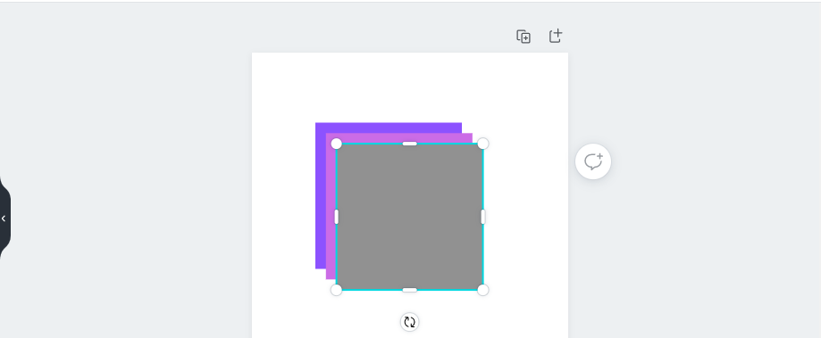 

 

Gambar 6.1 Select layer pertama

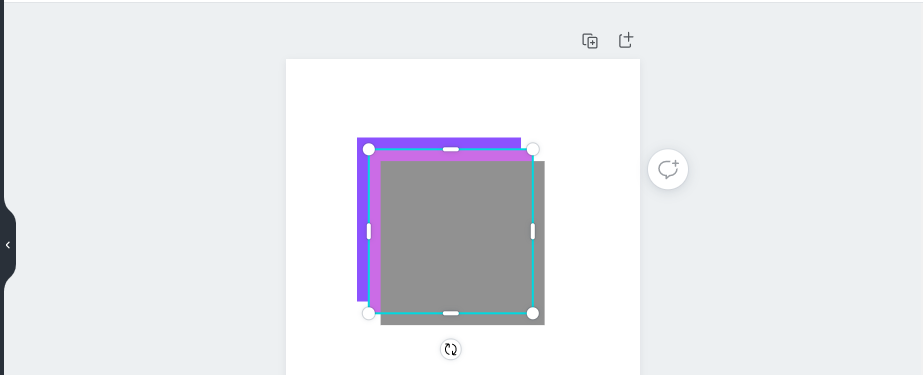 

 

Gambar 6.2 Select layer kedua

## Memindahkan Elemen dengan Arrow Key
Anda dapat memindahkan elemen dengan menggunakan arrow key (panah atas, bawah, kanan, kiri). Caranya adalah select object, kemudian pencet tombol arrow key. Hal ini akan memindahkan elemen sebanyak 1 pixel untuk sekali pencet tombol. Ada pula short cut `Shift + arrow key`, yang akan memindahkan elemen sebanyak 10 pixel. Hal ini berguna untuk meletakkan elemen pada posisi yang sangat presisi.

## Membuat Gradient pada Background
Pada Elemen, cari “gradient”. Kemudian cari elemen gradient yang berbentuk persegi.

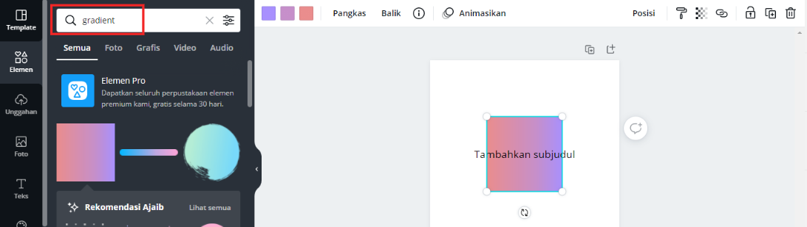 

 

Gambar 6.3 Insert elemen gradient

Kemudian perbesar elemen tersebut hingga memenuhi canvas.

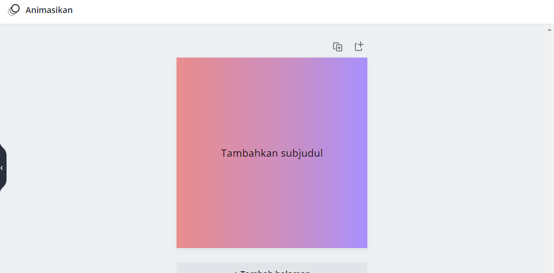 

 

Gambar 6.4 Elemen gradient diperbesar

Anda dapat mengubah warna pada gradient. Caranya adalah select elemen gradient kemudian ubah warna. Anda juga dapat mengubah arah gradient dengan mengklik menu **Balik**.

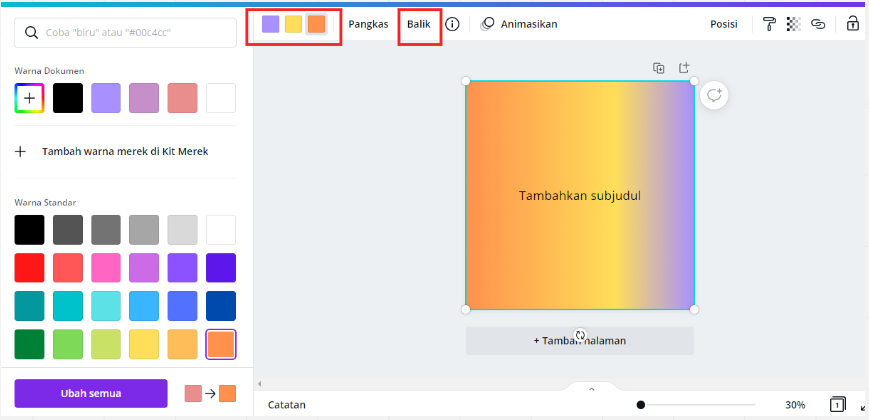 

 

Gambar 6.5 Ubah warna elemen

## Cara Menambahkan Teks

Dengan short cut `T`, Anda dapat langsung menambahkan teks dengan mudah, tanpa perlu mencari menu teks lagi.

## Cara Upload Gambar Lebih Cepat

Dengan mendrag gambar dari folder Anda langsung, Anda dapat mengupload gambar lebih cepat dari biasanya.

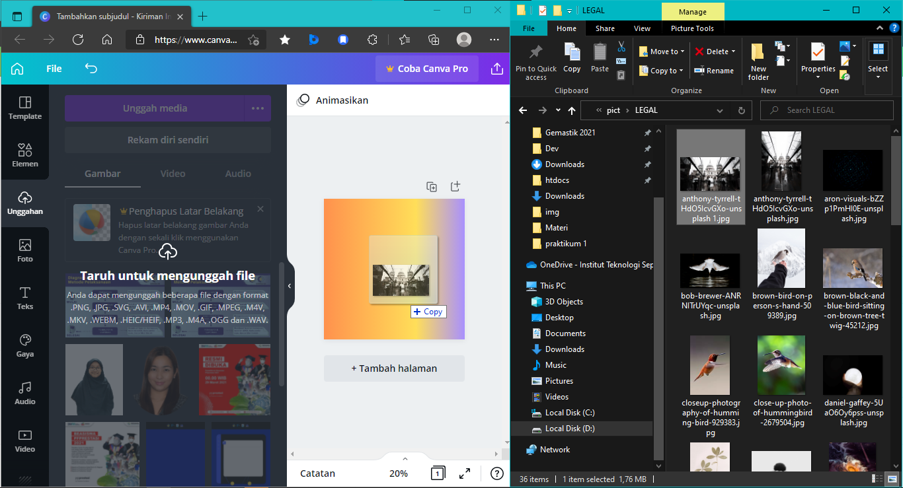 

 

Gambar 6.6 Upload gambar dengan drag

## Cara Duplikat Elemen Lebih Cepat
Caranya adalah dengan select elemen, kemudian menggunakan shortcut `Ctrl + D`. Bisa pula dengan select elemen, kemudian `Alt + drag elemen` dengan mouse ke arah mana pun.

## Zooming In dan Zooming Out
Dengan menggunakan `Ctrl + -` (untuk Zooming out) atau `Ctrl + +` (untuk Zooming in). Bisa juga memakai `Ctrl + scroll` mouse Anda.

## Filtering Elemen
Caranya adalah ke menu **Elemen**, tulis dulu keyword pencariannya, kemudian klik tombol filter seperti pada gambar.

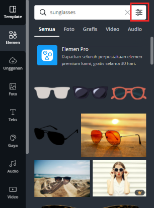 

 

Gambar 6.7 Filtering elemen

Anda bisa melakukan filter berdasarkan warna, dan sebagainya.

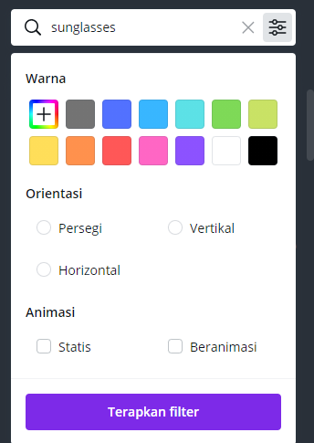 

 

Gambar 6.8 Filtering elemen berdasar warna

Anda juga bisa mem-filter elemen gratis, dengan copy paste kode ini di pencarian elemen.

`brand:BAAAAP7rQ8M`

Anda dapat pula menambahkan keyword, contoh:

`brand:BAAAAP7rQ8M heart`

## Membuat Hyperlink
Hyperlink dapat berguna, salah satunya jika Anda ingin membuat pdf yang berisi hyperlink. Caranya adalah select text yang ingin diberi hyperlink, kemudian klik **Tautan**. Masukkan link tujuan, kemudian hyperlink akan terbuat.

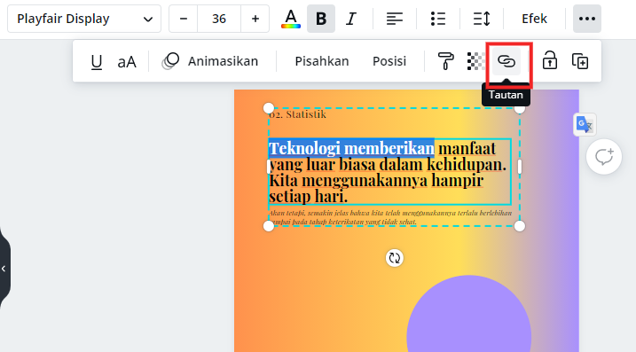 

 

Gambar 6.9 Membuat hyperlink

## Cara Memposisikan Elemen
Ada dua cara:
1. Dengan select elemen, kemudian **klik titik tiga**, kemudian **Posisi**, kemudian pilih posisinya. Contohnya, jika benar-benar ingin di tengah dapat memilih Tengah dan Tengah.

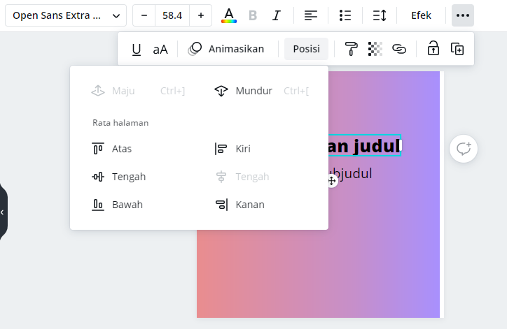 

 

Gambar 6.10 Memposisikan elemen

2. Dengan menggunakan penggaris. Contoh di bawah, silakan penggaris ke kanan (yang dikotaki merah),

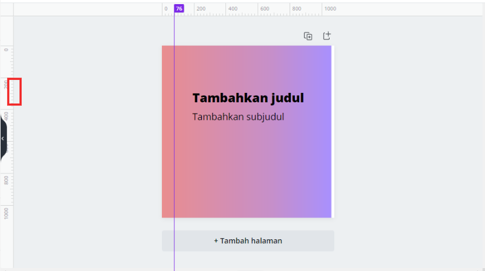 

 

Gambar 6.11 Menggunakan penggaris untuk memposisikan elemen

Kemudian Anda bisa menjadikannya acuan untuk meletakkan elemen.

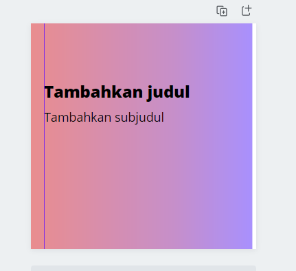 

 

Gambar 6.12 Menggunakan penggaris untuk memposisikan elemen
