# 1. Selayang Pandang
Canva adalah adalah design tool gratis. Canva sangat membantu di dunia content-marketing, dan cocok untuk grafis apapun yang ingin anda desain. Baik untuk social media, website atau blog, PPT presentasi, dan lainnya. Contoh desain yang dibuat menggunakan canva :

# 2. Persiapan
Yang perlu anda persiapkan dalam menggunakan canva yaitu :
1. Perangkat berupa HP, Laptop, PC, dsb.
2. Internet yang memadai
3. Browser yang mensupport
4. Browser yang dapat anda gunakan yaitu chrome, mozilla, microsoft edge, dsb.
5. Akun email untuk membuat akun canva.

Tentu untuk mengakses atau menggunakan canva terlebih dahulu dianjurkan untuk membuat akun dengan menggunakan email. Dengan adanya akun tersebut akan **memudahkan anda untuk menyimpan desain yang telah dibuat**. Pada modul ini kami memberikan contoh langkah dengan menggunakan perangkat laptop atau PC.

Adapun langkah-langkahnya sebagai berikut :

#### 1. Membuka halaman canva dengan alamat www.canva.com pada penelusuran google, sebagai berikut :

#### 2.  Maka selanjutnya tampilan yang akan diberikan adalah halaman utama canva. Selanjutnya arahkan kursor anda ke tombol Daftar dan klik tombol tersebut.
#### 3. Tampilan yang akan diberikan selanjutnya merupakan pop up pendaftaran dengan akun google, akun facebook, atau email yang anda punya. Anda cukup memilih satu di antaranya.

Apabila anda memilih :
##### a. **Daftar dengan Google**, maka anda akan diarahkan untuk memilih akun google yang ingin anda daftarkan.

##### b.  **Daftar dengan Facebook**, maka anda akan diarahkan ke halaman Log In facebook.

##### c. **Daftar dengan email**, maka anda akan diarahkan ke halaman pendaftaran dengan email.

# 3. Mengenal Canva
## 3.1 Halaman Utama

Setelah anda memiliki akun dan melakukan login maka anda akan diarahkan ke halaman utama dengan tampilan sebagai berikut :
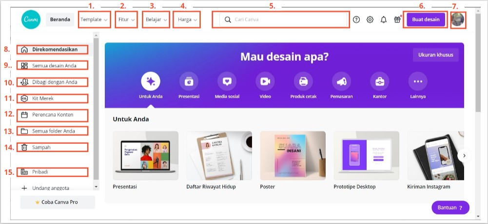

Adapun berdasarkan keterangan nomor yang ada pada gambar halaman utama tersebut dapat diketahui bahwa pada nomor :
### 1. Template
Pada menu ini terdapat template-template yang disediakan Canva, dan dikategorikan menjadi beberapa kategori. Ada **pribadi**, **bisnis**, **pemasaran**,dan **sedang tren**. Pada setiap kategori tersebut terdapat beberapa jenis desain yang dapat anda pilih. Apabila anda mengarahkan kursor pada menu tersebut, maka akan menampilkan kategori  sebagai berikut :
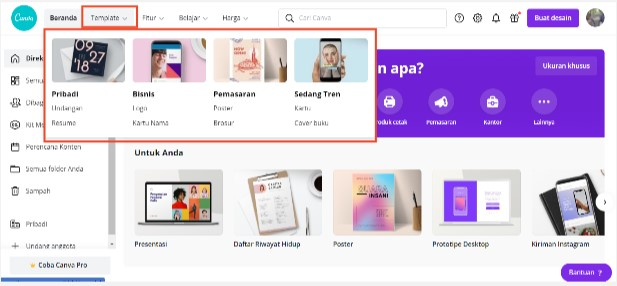

Anda pun dapat memilih template mana yang anda perlukan berdasarkan pilihan kategori yang diberikan. Kemudian apabila anda menekan menu template tanpa memilih kategori, maka anda akan diarahkan ke halaman berikut:

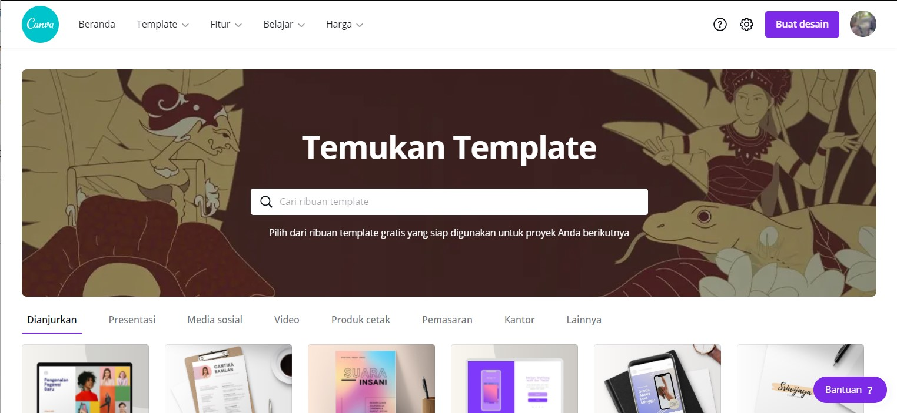

Pada halaman tersebut banyak sekali template yang telah disediakan canva secara gratis dengan berbagai pilihan dan kategori.

### 2. Fitur
Pada menu **Fitur**, terdapat jenis-jenis fitur desain yang tersedia. Misalkan **foto, ikon, produk cetak, aplikasi**, dan lain-lain. Apabila kursor anda arahkan ke menu tersebut maka tampilan sebagai berikut :

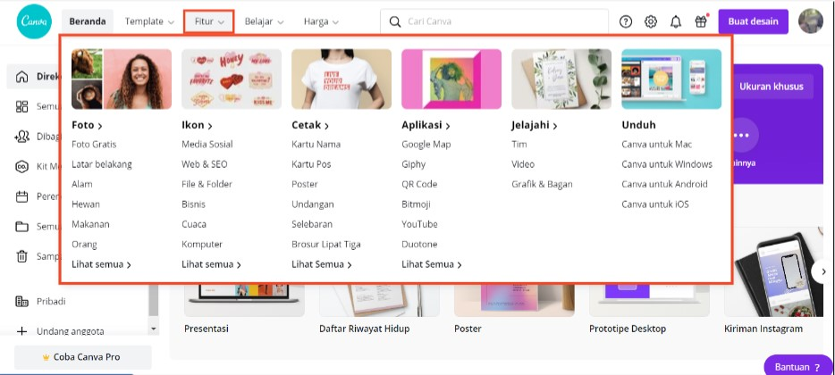

Anda dapat memilih fitur mana yang anda perlukan berdasarkan pilihan yang diberikan. Adapun apabila anda menekan menu fitur tanpa memilih kategori, maka anda akan diarahkan ke halaman berikut :

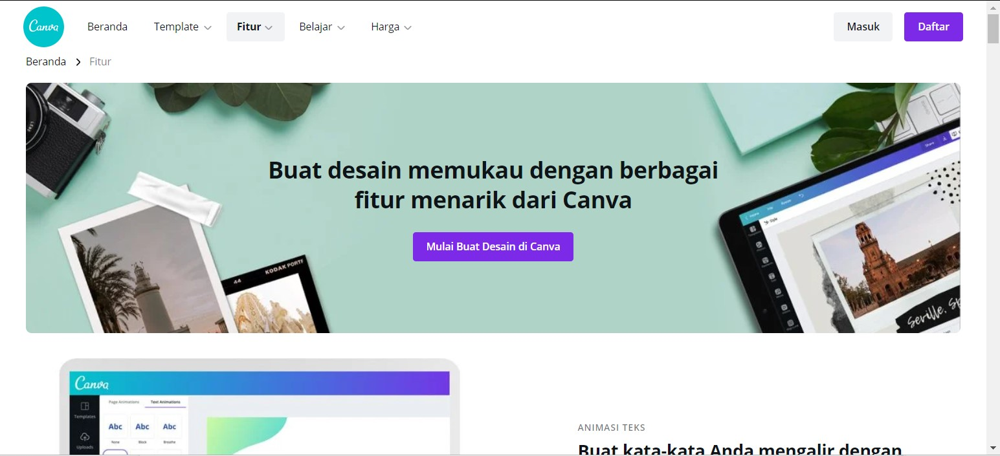

### 3. Belajar
Di sini terdapat tutorial singkat cara menggunakan Canva dan membuat berbagai desain dari Canva diantaranya yaitu **desain, bisnis, edukasi**, dan **fotografi**. Apabila kursor anda arahkan ke menu tersebut, maka tampilan akan menampilkan pilihan sebagai berikut :

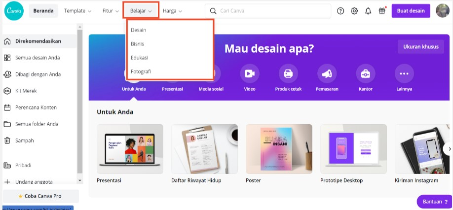

Anda dapat memilih untuk mempelajari apa berdasarkan pilihan yang diberikan. Adapun apabila anda menekan menu belajar tanpa memilih kategori, maka anda akan diarahkan ke halaman berikut :

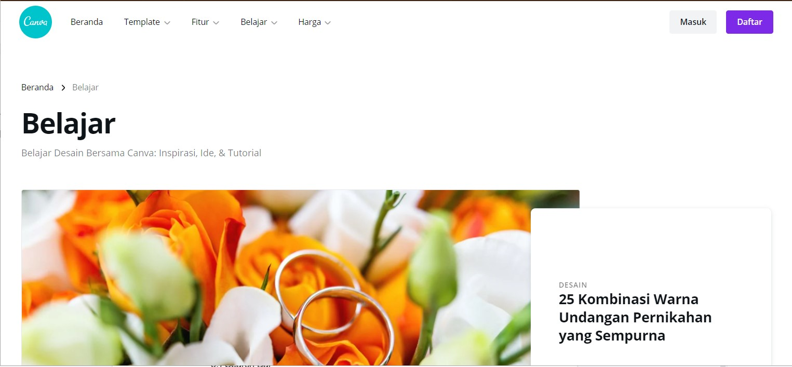

Pada halaman tersebut berbagai tutorial atau pembelajaran desain disediakan oleh canva secara gratis.

### 4. Harga
Pada menu ini anda dapat menemukan paket berbayar dari Canva. Untuk pemula, Canva gratis sangat cukup dan sudah mumpuni untuk desain. Dimana apabila kursor, anda arahkan ke menu tersebut maka tampilan akan menampilkan pilihan sebagai berikut :

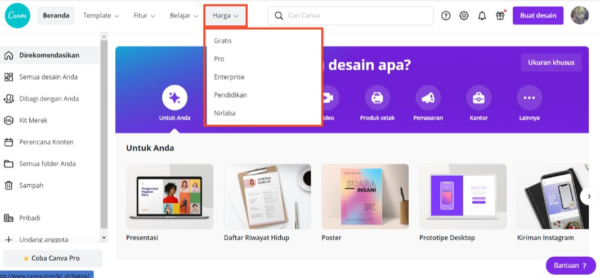

Anda dapat memilih pilihan mana yang anda perlukan. Adapun apabila anda menekan menu harga tanpa memilih pilihan, maka anda akan diarahkan ke halaman berikut :

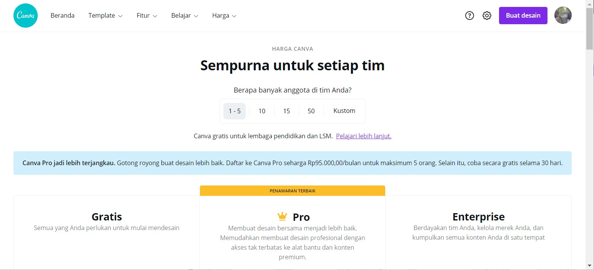

### 5. Search Bar
Search bar adalah dimana anda dapat dengan cepat menemukan template apa pun, desain dengan dimensi apa pun yang anda inginkan tanpa harus repot-repot scroll. Misalkan jika anda ingin membuat post Instagram, ketikkan “Instagram”.

### 6. Buat Desain
Anda dapat memulai membuat desain dengan menekan tombol tersebut. Maka tampilan yang akan diberikan sebagai berikut:

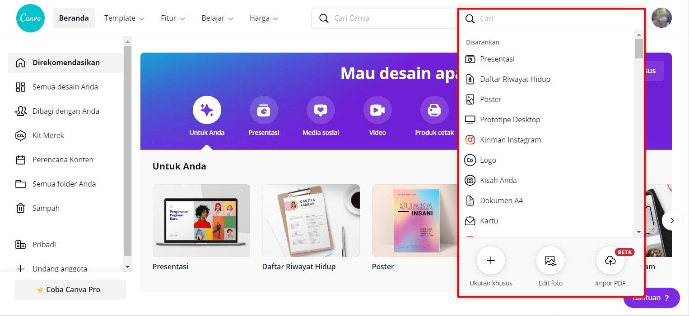

Berdasarkan pilihan yang diberikan anda dapat memilih desain apa yang ingin anda buat. Dimana pilihan tersebut akan mengarahkan anda ke halaman desain dengan kanvas yang telah disediakan sesuai  ukuran default dari canva. Misal, anda memilih untuk mendesain cerita instagram maka anda akan diarahkan ke halaman berikut dengan ukuran kanvas yang telah ditentukan oleh canva :

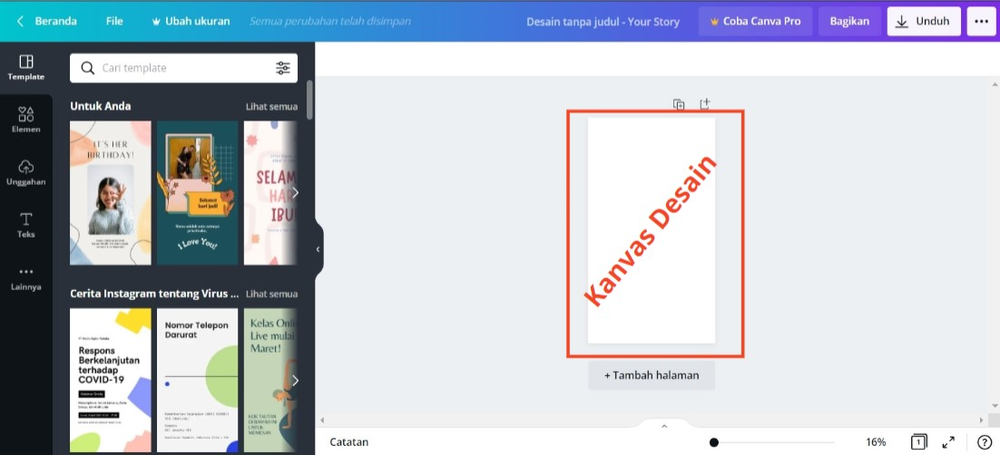

Adapun apabila anda ingin meng custom ukuran kanvas dari desain yang ingin anda buat. Maka anda dapat memilih pilihan ukuran khusus sebagai berikut :

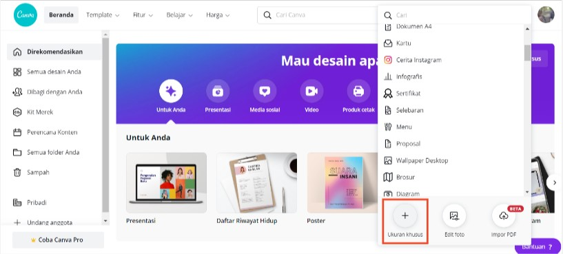

Apabila anda memilih pilihan tersebut maka tampilan selanjutnya yang akan ditampilkan yaitu form untuk melakukan input ukuran kanvas yang anda inginkan sebagai berikut :

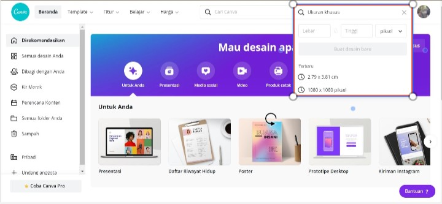

Sama seperti sebelumnya, maka selanjutnya anda akan diarahkan ke halaman desain dengan ukuran kanvas yang telah anda tentukan.

### 7. Akun
### 8. Direkomendasikan
### 9. Semua Desain Anda
### 10. Dibagi dengan anda
### 11. Kit Merek
### 12. Perencanaan Konten
### 13. Semua Folder Anda
### 14. Sampah
### 15. Pribadi

## 3.2 Halaman Design
## 3.3 

# 4. Langkah Mendesain pada Canva
## 4.1 Langkah 1: Tentukan apa yang ingin anda desain

# Praktek
# Tips & Trik