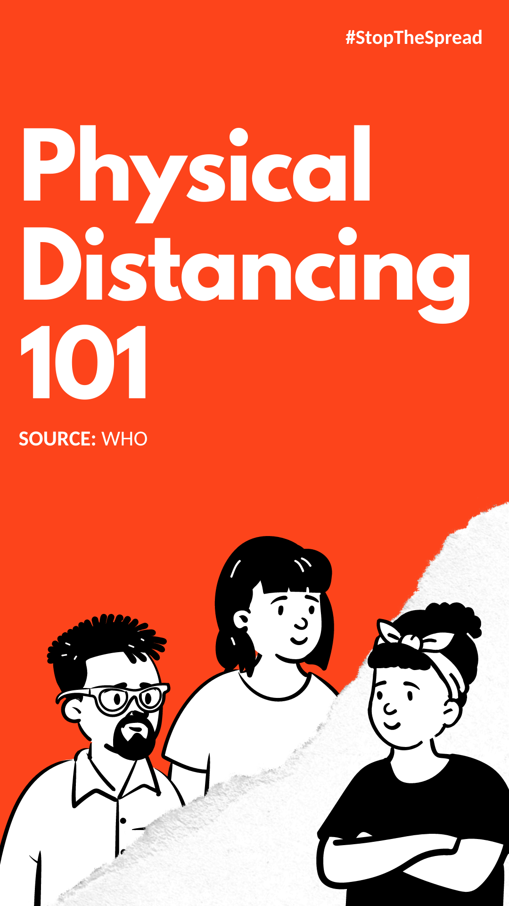

# Selayang Pandang
Canva adalah adalah design tool gratis. Canva sangat membantu di dunia content-marketing, dan cocok untuk grafis apapun yang ingin anda desain. Baik untuk social media, website atau blog, PPT presentasi, dan lainnya. Contoh desain yang dibuat menggunakan canva :

Gambar 1.1 Contoh desain poster biologi

Gambar 1.2 Contoh desain postingan facebook

Gambar 1.3 Contoh desain story instagram atau WA
# Persiapan 
# Mengenal Canva
# Langkah Mendesain pada Canva
# Praktek
# Tips & Trik