# 1. Selayang Pandang

Canva adalah adalah design tool gratis. Canva sangat membantu di dunia content-marketing, dan cocok untuk grafis apapun yang ingin anda desain. Baik untuk social media, website atau blog, PPT presentasi, dan lainnya. Contoh desain yang dibuat menggunakan canva :

# 2. Persiapan

Yang perlu anda persiapkan dalam menggunakan canva yaitu :

1. Perangkat berupa HP, Laptop, PC, dsb.
2. Internet yang memadai
3. Browser yang mensupport
4. Browser yang dapat anda gunakan yaitu chrome, mozilla, microsoft edge, dsb.
5. Akun email untuk membuat akun canva.

Tentu untuk mengakses atau menggunakan canva terlebih dahulu dianjurkan untuk membuat akun dengan menggunakan email. Dengan adanya akun tersebut akan **memudahkan anda untuk menyimpan desain yang telah dibuat**. Pada modul ini kami memberikan contoh langkah dengan menggunakan perangkat laptop atau PC.

Adapun langkah-langkahnya sebagai berikut :

#### 1. Membuka halaman canva dengan alamat www.canva.com pada penelusuran google, sebagai berikut :

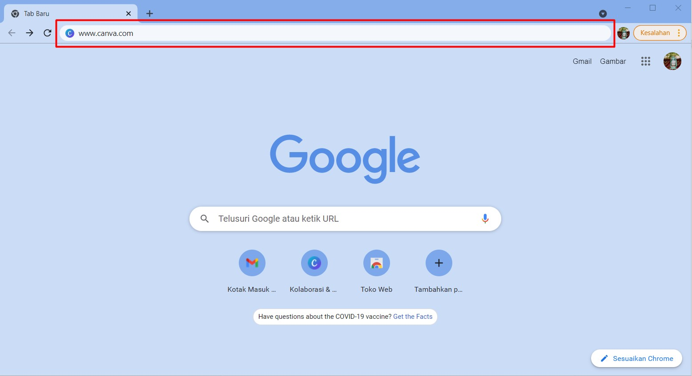

#### 2. Maka selanjutnya tampilan yang akan diberikan adalah halaman utama canva. Selanjutnya arahkan kursor anda ke tombol Daftar dan klik tombol tersebut.

#### 3. Tampilan yang akan diberikan selanjutnya merupakan pop up pendaftaran dengan akun google, akun facebook, atau email yang anda punya. Anda cukup memilih satu di antaranya.

Apabila anda memilih :

a. **Daftar dengan Google**, maka anda akan diarahkan untuk memilih akun google yang ingin anda daftarkan.

b. **Daftar dengan Facebook**, maka anda akan diarahkan ke halaman Log In facebook.

c. **Daftar dengan email**, maka anda akan diarahkan ke halaman pendaftaran dengan email.

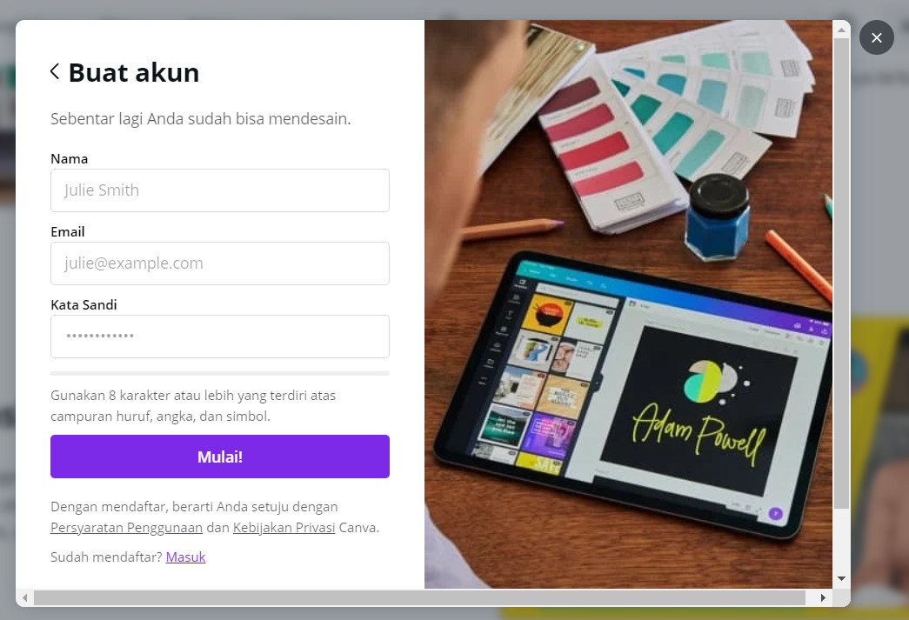

# 3. Mengenal Canva

## 3.1 Halaman Utama

Setelah anda memiliki akun dan melakukan login maka anda akan diarahkan ke halaman utama dengan tampilan sebagai berikut :

Adapun berdasarkan keterangan nomor yang ada pada gambar halaman utama tersebut dapat diketahui bahwa pada nomor :

### 1.) Template

Pada menu ini terdapat template-template yang disediakan Canva, dan dikategorikan menjadi beberapa kategori. Ada **pribadi**, **bisnis**, **pemasaran**,dan **sedang tren**. Pada setiap kategori tersebut terdapat beberapa jenis desain yang dapat anda pilih. Apabila anda mengarahkan kursor pada menu tersebut, maka akan menampilkan kategori sebagai berikut :

Anda pun dapat memilih template mana yang anda perlukan berdasarkan pilihan kategori yang diberikan. Kemudian apabila anda menekan menu template tanpa memilih kategori, maka anda akan diarahkan ke halaman berikut:

Pada halaman tersebut banyak sekali template yang telah disediakan canva secara gratis dengan berbagai pilihan dan kategori.

### 2.) Fitur

Pada menu **Fitur**, terdapat jenis-jenis fitur desain yang tersedia. Misalkan **foto, ikon, produk cetak, aplikasi**, dan lain-lain. Apabila kursor anda arahkan ke menu tersebut maka tampilan sebagai berikut :

Anda dapat memilih fitur mana yang anda perlukan berdasarkan pilihan yang diberikan. Adapun apabila anda menekan menu fitur tanpa memilih kategori, maka anda akan diarahkan ke halaman berikut :

### 3.) Belajar

Di sini terdapat tutorial singkat cara menggunakan Canva dan membuat berbagai desain dari Canva diantaranya yaitu **desain, bisnis, edukasi**, dan **fotografi**. Apabila kursor anda arahkan ke menu tersebut, maka tampilan akan menampilkan pilihan sebagai berikut :

Anda dapat memilih untuk mempelajari apa berdasarkan pilihan yang diberikan. Adapun apabila anda menekan menu belajar tanpa memilih kategori, maka anda akan diarahkan ke halaman berikut :

Pada halaman tersebut berbagai tutorial atau pembelajaran desain disediakan oleh canva secara gratis.

### 4.) Harga

Pada menu ini anda dapat menemukan paket berbayar dari Canva. Untuk pemula, Canva gratis sangat cukup dan sudah mumpuni untuk desain. Dimana apabila kursor, anda arahkan ke menu tersebut maka tampilan akan menampilkan pilihan sebagai berikut :

Anda dapat memilih pilihan mana yang anda perlukan. Adapun apabila anda menekan menu harga tanpa memilih pilihan, maka anda akan diarahkan ke halaman berikut :

### 5.) Search Bar

Search bar adalah dimana anda dapat dengan cepat menemukan template apa pun, desain dengan dimensi apa pun yang anda inginkan tanpa harus repot-repot scroll. Misalkan jika anda ingin membuat post Instagram, ketikkan “Instagram”.

### 6.) Buat Desain

Anda dapat memulai membuat desain dengan menekan tombol tersebut. Maka tampilan yang akan diberikan sebagai berikut:

Berdasarkan pilihan yang diberikan anda dapat memilih desain apa yang ingin anda buat. Dimana pilihan tersebut akan mengarahkan anda ke halaman desain dengan kanvas yang telah disediakan sesuai ukuran default dari canva. Misal, anda memilih untuk mendesain cerita instagram maka anda akan diarahkan ke halaman berikut dengan ukuran kanvas yang telah ditentukan oleh canva :

Adapun apabila anda ingin meng custom ukuran kanvas dari desain yang ingin anda buat. Maka anda dapat memilih pilihan ukuran khusus sebagai berikut :

Apabila anda memilih pilihan tersebut maka tampilan selanjutnya yang akan ditampilkan yaitu form untuk melakukan input ukuran kanvas yang anda inginkan sebagai berikut :

Sama seperti sebelumnya, maka selanjutnya anda akan diarahkan ke halaman desain dengan ukuran kanvas yang telah anda tentukan.

### 7.) Akun

Pada menu ini anda disuguhkan beberapa pilihan, dimana terdapat pilihan sebagai berikut :

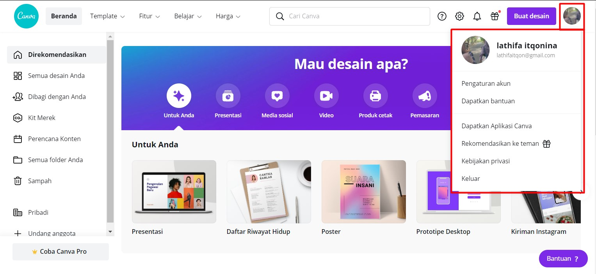

Pada pilihan pengaturan akun anda dapat mengubah mengubah profil foto dan sebagainya. Tampilan sebagai berikut :

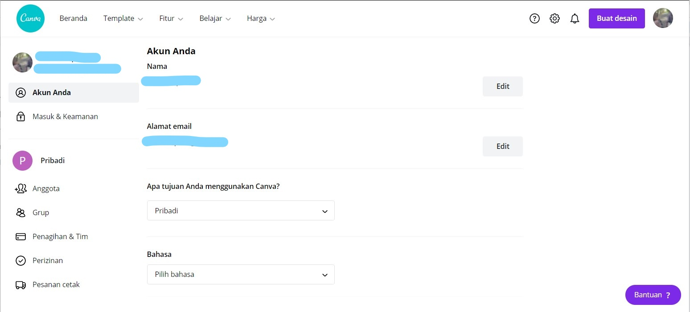

### 8.) Direkomendasikan

Di sini terdapat sekilas template-template yang mungkin anda sukai, juga design yang sudah anda pernah buat sebelumnya. Hal ini memudahkan jika anda langsung ingin mengakses design yang terakhir kali anda buat. Tampilan halaman sebagai berikut :

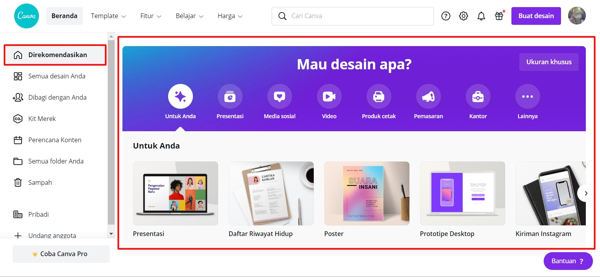

### 9.) Semua Desain Anda

Adalah tempat semua file design yang telah anda buat. Tampilan sebagai berikut :

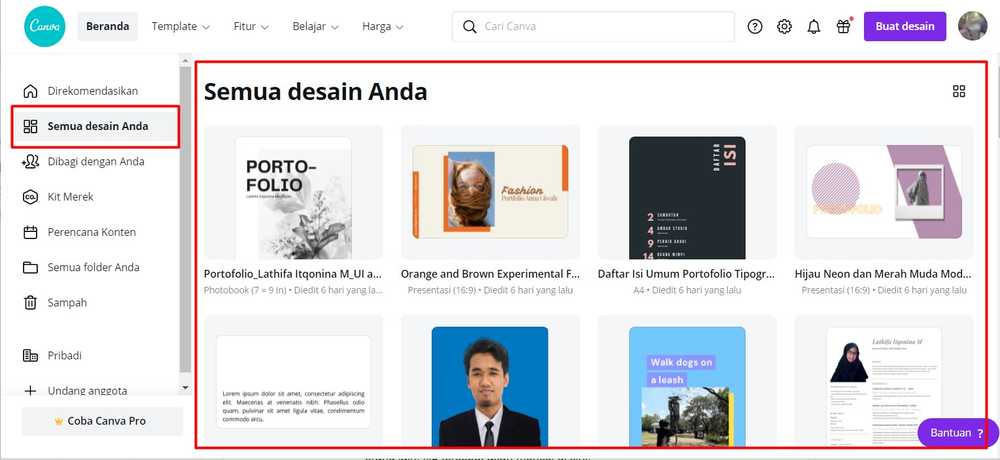

### 10.) Dibagi dengan anda

Jika anda pernah sharing design anda atau membuka file sharing dari orang lain, file tersebut akan muncul di sini. Tampilan sebagai berikut :

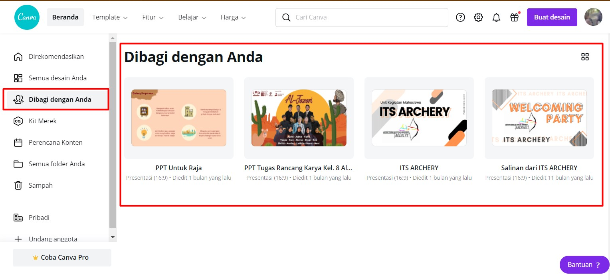

### 11.) Kit Merek

Menu ini untuk mendesain sebuah brand. Canva mempercepat proses pembuatan brand, baik itu logo dan sebagainya. Canva menyediakan palet, font, dan lainnya yang dibutuhkan untuk mendesain sebuah brand. Tampilan sebagai berikut :

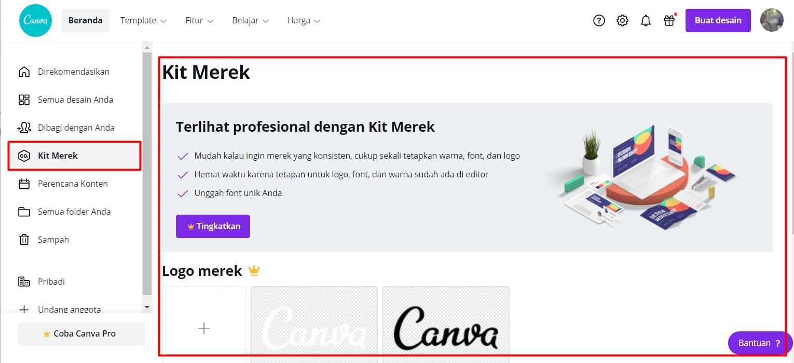

### 12.) Perencanaan Konten

Anda dapat merencanakan konten apa yang akan anda buat pada menu ini. Di mana pada menu tersebut anda akan diarahkan ke halaman berupa kalender untuk membuat agenda. Tampilan sebagai berikut :

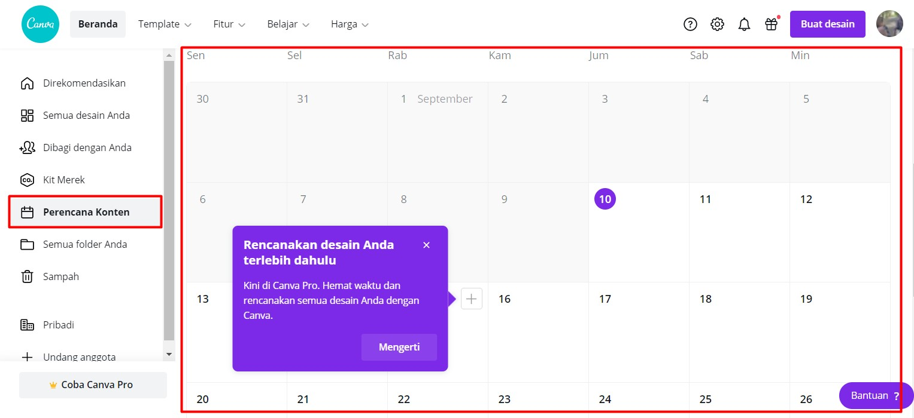

### 13.) Semua Folder Anda

Menu ini memudahkan anda untuk mengorganisir file-file desain yang telah anda buat. Tampilan sebagai berikut :

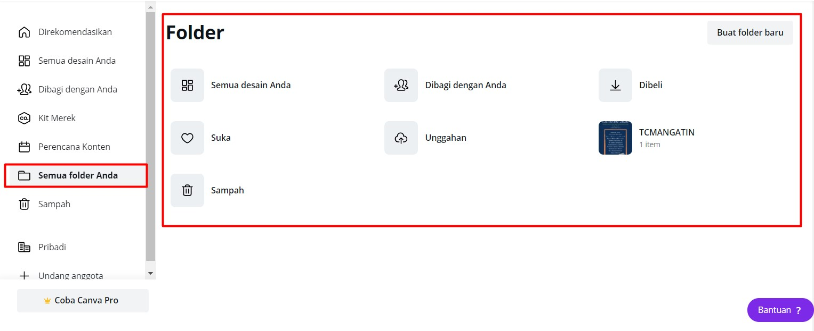

### 14.) Sampah

Jika ada file desain yang anda buang ke tempat sampah, file itu akan masuk ke trash dulu, sebelum bisa di-delete permanen atau di-restore. Tampilan sebagai berikut :

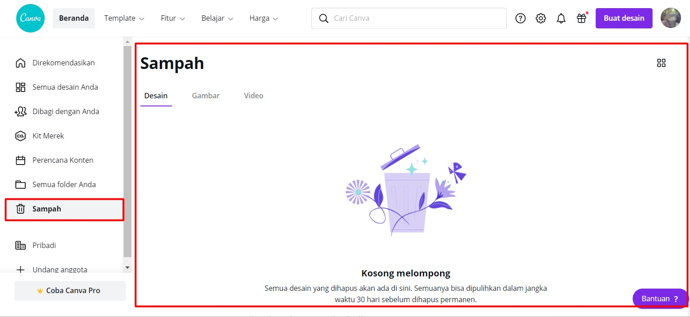

### 15.) Pribadi

Pada menu ini anda dapat memilih template yang telah anda buat sebelumnya, membuat tim dan lain-lain. Tampilan sebagai berikut:

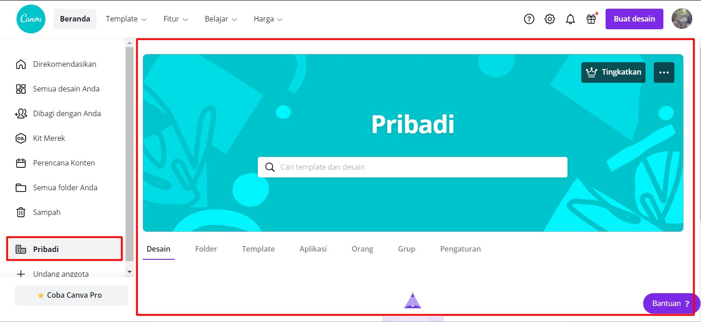

## 3.2 Halaman Design

Setelah anda mengetahui bagian-bagian dalam halaman utama anda, selanjutnya anda perlu untuk mengetahui bagian-bagian yang terdapat pada halaman desain. Dimana pada contoh tampilan berikut merupakan halaman desain untuk membuat cerita instagram :

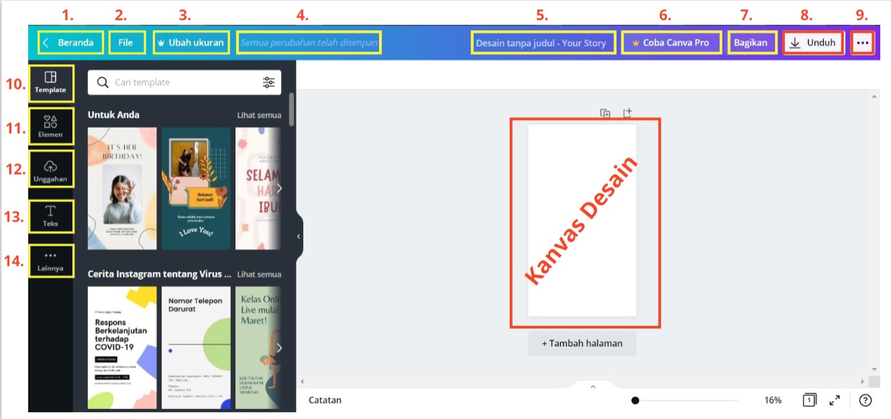

Adapun berdasarkan keterangan nomor yang ada pada gambar halaman desain tersebut dapat diketahui bahwa pada nomor :

### 1.) Beranda

Merupakan tombol yang akan mengarahkan anda kembali ke halaman utama atau beranda.

### 2.) File

Apabila anda menekan tombol ini maka akan terdapat beberapa pilihan yang ditampilkan.

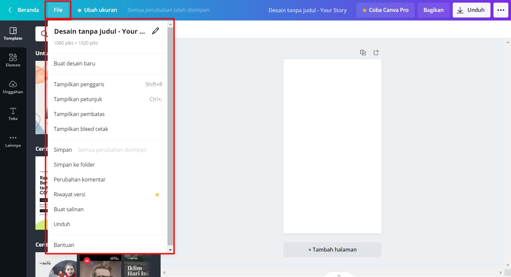

tombol ini terdiri dari beberapa menu, di antaranya:

#### a. _Buat desain baru_ untuk membuat desain baru. Dimana apabila anda menekan tombol ini akan ada pilihan kategori desain yang dapat anda pilih :

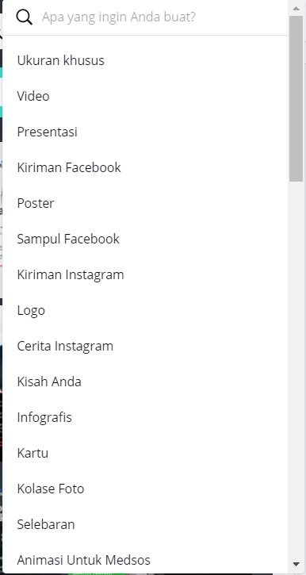

Berdasarkan apa yang anda pilih kemudian anda akan diarahkan ke halaman baru sesuai kategori.

#### b. _Tampilkan penggaris_ untuk menampilkan penggaris agar kita dapat mengetahui ukuran elemen yang terdapat pada desain. Selain itu dapat memudahkan kita dalam menempatkan setiap elemen atau jarak yang diperlukan antar elemen. Tampilan :

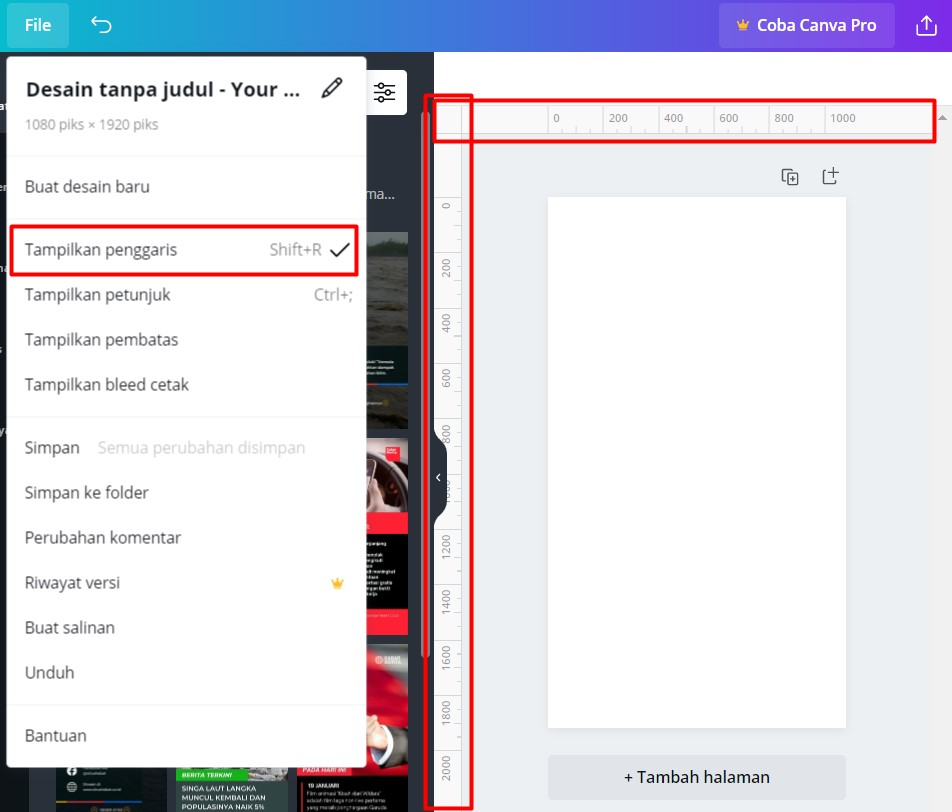

#### c. _Tampilkan petunjuk_ sama seperti penggaris pada menu ini berfungsi untuk memudahkan kita dalam mendesain dengan adanya garis batuan (petunjuk). Cara menggunakan _Show guides_ adalah:

1. Tampilkan ruler dulu dengan mengaktifkan menu **tampilkan penggaris**.

2. Aktifkan menu **tampilkan petunjuk**.

3. Tarik garis dari penggaris sampai ke posisi yang anda inginkan. Maka akan muncul semacam garis guide (petunjuk). Jika **tampilkan petunjuk** dinonaktifkan, maka garis guide itu akan hilang. Shortcut untuk **tampilkan petunjuk** adalah `Ctrl + ;`.

#### d. _Tampilkan pembatas_ untuk menampilkan margin di dalam kanvas. Tampilan :

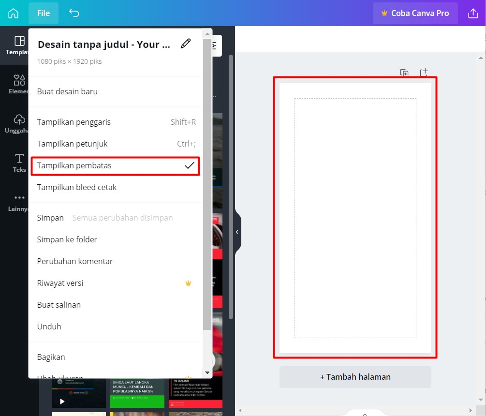

#### e. _Tampilkan bleed cetak_ untuk menunjukkan garis bleed yang berguna jika anda ingin print desain ini dan tidak ingin ada sisa putih pada hasil print anda. Tampilan terdapat garis putus-putus mengelilingi kanvas:

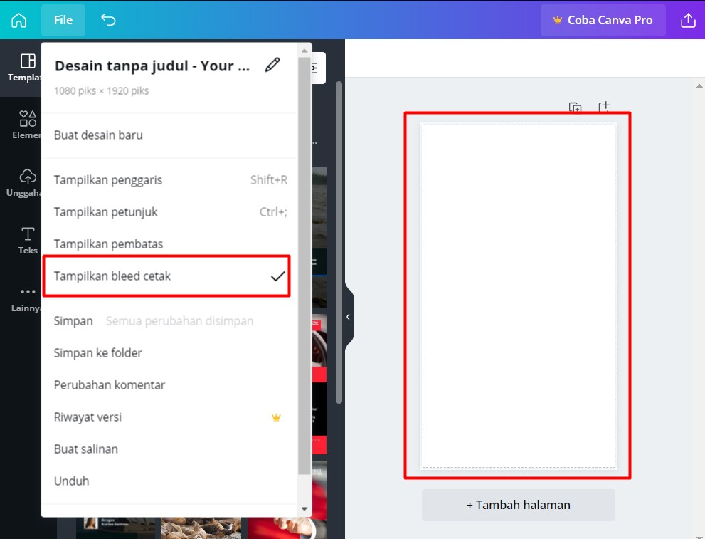

#### f. _Simpan_ untuk simpan desain;

#### g. _Simpan ke folder_ untuk mengorganisir desain pada folder tertentu;

#### h. _Perubahan Komentar_ untuk menampilkan comment yang sudah resolved;

#### i. _Riwayat versi_ dapat melihat versi desain pada waktu tertentu pada masa lalu;

#### j. _Buat salinan_ untuk membuat copy dari desain sekarang.

### 3.) Ubah Ukuran (Canva Pro)

Menu ini dapat membuat desain dengan resolusi yang berbeda secara pintar, dengan desain yang sekarang.

### 4.) Status Menyimpan

Anda dapat melihat status saving pada desainmu pada bagian ini.

### 5.) Judul Desain

Merupakan field untuk anda menuliskan judul dari desain yang sedang anda buat.

### 6.) Coba Canva Pro

Menu ini untuk memudahkanmu untuk mengakses atau purchase Canva premium.

### 7.) Bagikan

Anda dapat share file desain ke orang lain, baik dengan akses view, edit, atau dapat menggunakan sebagai template. Anda dapat menginvite orang lain dengan menambahkan email mereka atau memberi mereka shareable link. Tampilan :
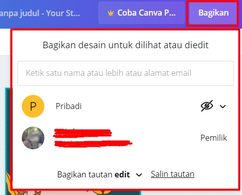

### 8.) Unduh

Di sini kamu dapat mendownload / mengexport hasil desain. Terdapat beberapa peraturan export juga di sini. Tampilan apabila anda menekan tombol unduh :

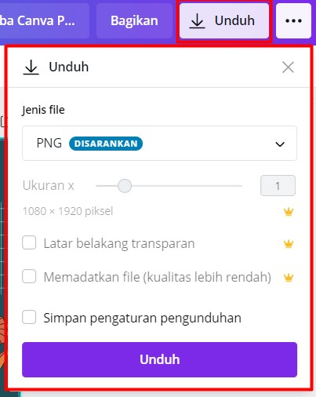

Tampilan jenis file:

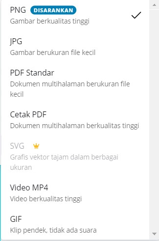

Anda dapat memilih jenis file yang akan anda unduh sesuai dengan jenis file yang ingin anda dapatkan.

### 9.) Opsi Lain

Opsi lain ini berbentuk 3 titik ke samping. Terdapat beberapa opsi bagaimana anda ingin mempublish desain anda. Ada bagian **Dianjurkan, bagikan**, dan **cetak**. Tampilan :

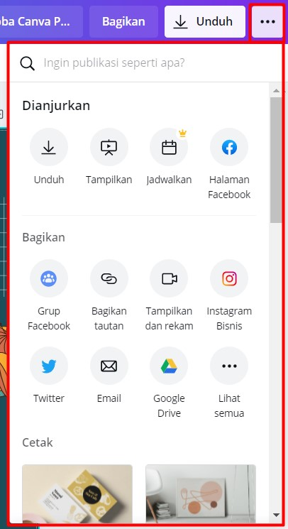

### 10.) Template

### 11.) Elemen

### 12.) Unggah

### 13.) Teks

### 14.) Lainnya

# 4. Langkah Mendesain pada Canva

## 4.1 Langkah 1: Tentukan apa yang ingin anda desain

# Praktek

# Tips & Trik
