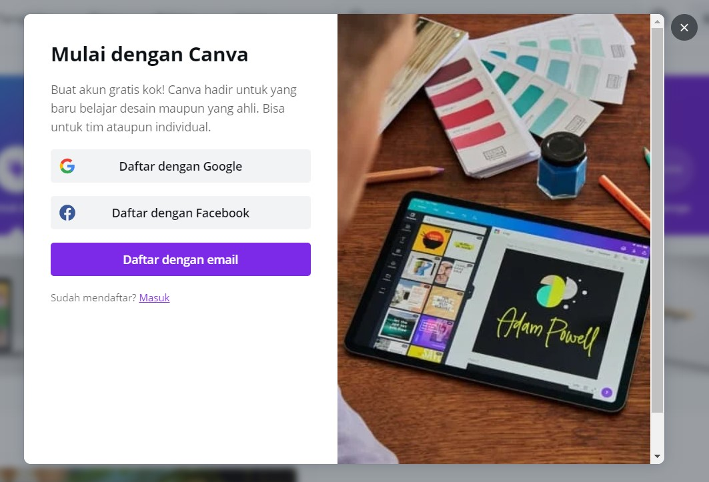
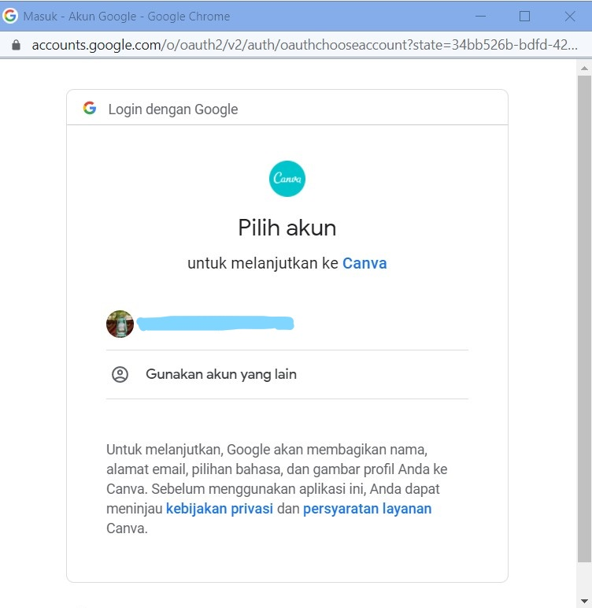
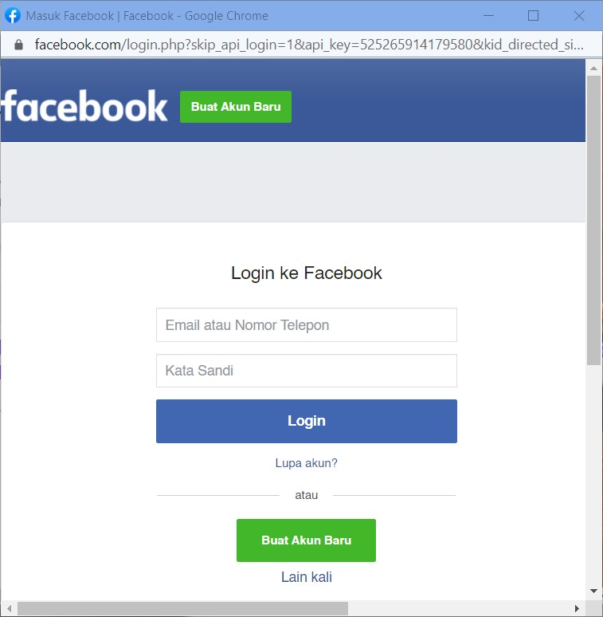

# Selayang Pandang
Canva adalah adalah design tool gratis. Canva sangat membantu di dunia content-marketing, dan cocok untuk grafis apapun yang ingin anda desain. Baik untuk social media, website atau blog, PPT presentasi, dan lainnya. Contoh desain yang dibuat menggunakan canva :

# Persiapan
Yang perlu anda persiapkan dalam menggunakan canva yaitu :
1. Perangkat berupa HP, Laptop, PC, dsb.
2. Internet yang memadai
3. Browser yang mensupport
4. Browser yang dapat anda gunakan yaitu chrome, mozilla, microsoft edge, dsb.
5. Akun email untuk membuat akun canva.

Tentu untuk mengakses atau menggunakan canva terlebih dahulu dianjurkan untuk membuat akun dengan menggunakan email. Dengan adanya akun tersebut akan **memudahkan anda untuk menyimpan desain yang telah dibuat**. Pada modul ini kami memberikan contoh langkah dengan menggunakan perangkat laptop atau PC.

Adapun langkah-langkahnya sebagai berikut :

#### 1. Membuka halaman canva dengan alamat www.canva.com pada penelusuran google, sebagai berikut :

#### 2.  Maka selanjutnya tampilan yang akan diberikan adalah halaman utama canva. Selanjutnya arahkan kursor anda ke tombol Daftar dan klik tombol tersebut.
#### 3. Tampilan yang akan diberikan selanjutnya merupakan pop up pendaftaran dengan akun google, akun facebook, atau email yang anda punya. Anda cukup memilih satu di antaranya.

Apabila anda memilih :
##### a. **Daftar dengan Google**, maka anda akan diarahkan untuk memilih akun google yang ingin anda daftarkan.

##### b.  **Daftar dengan Facebook**, maka anda akan diarahkan ke halaman Log In facebook.

##### c. **Daftar dengan email**, maka anda akan diarahkan ke halaman pendaftaran dengan email.

# Mengenal Canva
# Langkah Mendesain pada Canva
# Praktek
# Tips & Trik